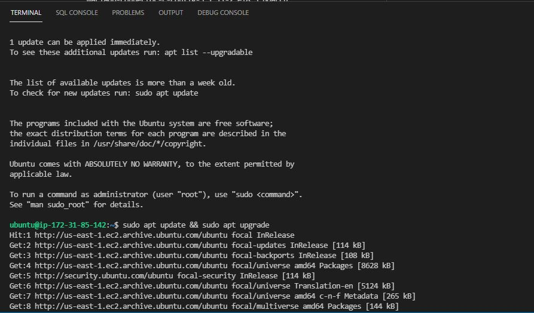
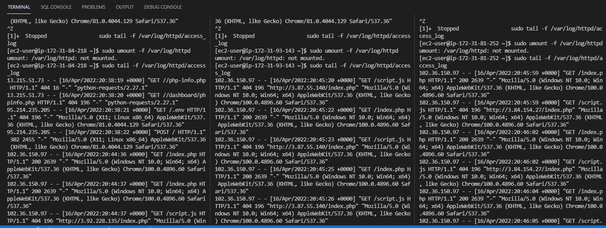

# Documentation for Project 7 - DevOps Tooling Solution
- Step 1 -- Setup Servers on AWS 
  
   - `sudo apt-get update && sudo apt-get upgrade` 

   -  
  
### Install Apache Load Balancer on LB Server and configure it to point traffic coming to LB to all Web Servers
### LoadBalancer Configuration scripts PBL Project 8

    ```
    #!/bin/bash
    #Install apache2
    #!/bin/bash
    sudo apt update
    sudo apt install apache2 -y
    sudo apt-get install libxml2-dev

    #Enable following modules:
    sudo a2enmod rewrite
    sudo a2enmod proxy
    sudo a2enmod proxy_balancer
    sudo a2enmod proxy_http
    sudo a2enmod headers
    sudo a2enmod lbmethod_bytraffic

    #Restart apache2 service
    sudo systemctl restart apache2
    ```

  - 
  - 
  
### Configure load balancing
    `sudo nano  /etc/apache2/sites-available/000-default.conf`

### Edit configuration file and paste code below
    ```
    <Proxy "balancer://mycluster">
               BalancerMember http://<WebServer1-Private-IP-Address>:80 loadfactor=5 timeout=1
               BalancerMember http://<WebServer2-Private-IP-Address>:80 loadfactor=5 timeout=1
               BalancerMember http://<WebServer3-Private-IP-Address>:80 loadfactor=5 timeout=1
               ProxySet lbmethod=bytraffic
               # ProxySet lbmethod=byrequests
        </Proxy>

        ProxyPreserveHost On
        ProxyPass / balancer://mycluster/
        ProxyPassReverse / balancer://mycluster/
    ```
### Restart apache server

    `sudo systemctl restart apache2`


  - 
  - 
  - 
  - 

### Unmount Access Logs from NFS Server
     `sudo umount -f /var/log/httpd`

  - 
  - 
  

### Configure Local DNS Names Resolution
    `sudo nano /etc/hosts`

### Edit the file 

    ```
    <WebServer1-Private-IP-Address> Web1
    <WebServer2-Private-IP-Address> Web2
    <WebServer3-Private-IP-Address> Web3
    ```
    ``sudo nano  /etc/apache2/sites-available/000-default.conf``
### Edit the file 
    ```
    BalancerMember http://Web1:80 loadfactor=5 timeout=1
    BalancerMember http://Web2:80 loadfactor=5 timeout=1
    BalancerMember http://Web3:80 loadfactor=5 timeout=1
    ```
   - 
   - 
 
### Access Web Servers from LB
	
   - 
   - 
   - 
